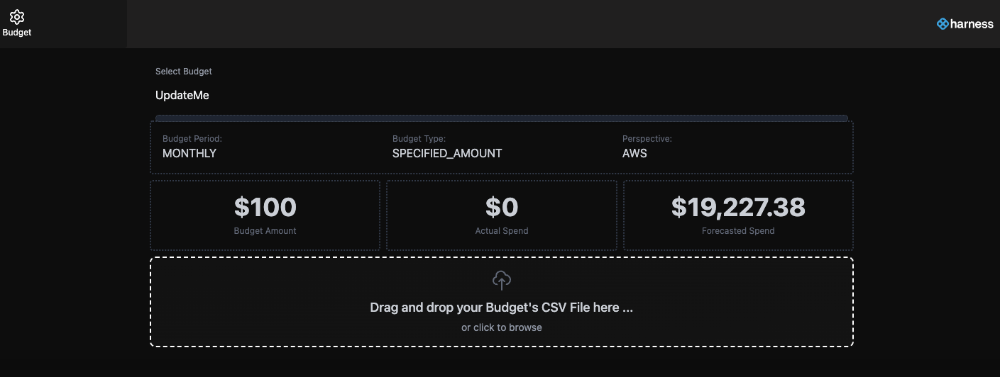

## Canary Budget allows you to easily upload new budgets to Harness. You would have to modify the code based on your custom format.





## Environment variables:
Make sure there is a .env file in the root folder with the following keys and values

HARNESS_API_KEY=XXXX

HARNESS_ACCOUNT_IDENTIFIER=XXXX

## Developing

Once you've created a project and installed dependencies with `npm install` (or `pnpm install` or `yarn`), start a development server:

```bash
npm run dev

# or start the server and open the app in a new browser tab
npm run dev -- --open
```

## Building

To create a production version of your app:

```bash
npm run build
```

You can preview the production build with `npm run serve`.

You can also copy the build directory with your .env file and run > node index.js

If you want to deploy in a hosting framework
> To deploy your app, you may need to install an [adapter](https://svelte.dev/docs/kit/adapters) for your target environment.
